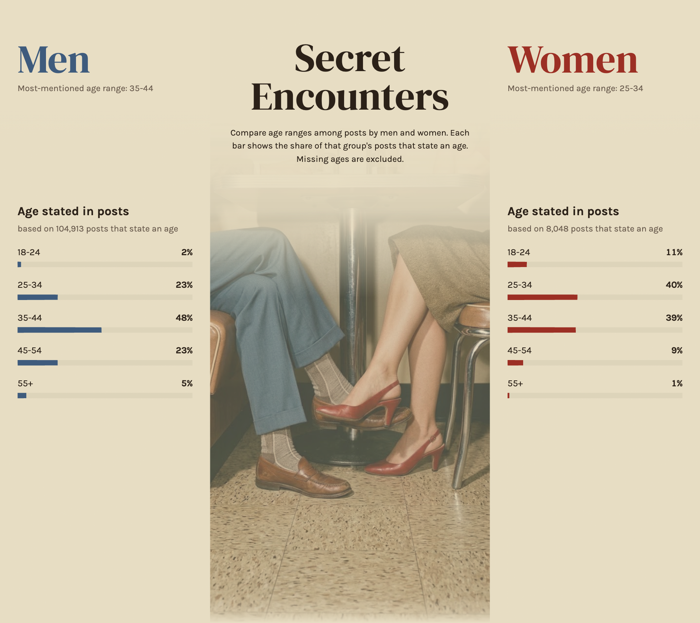
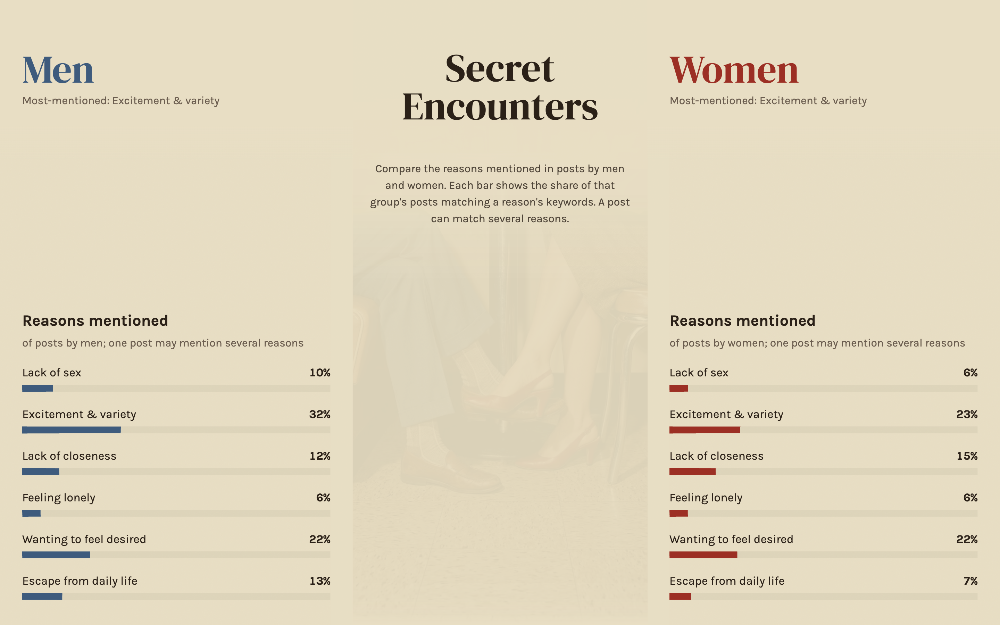
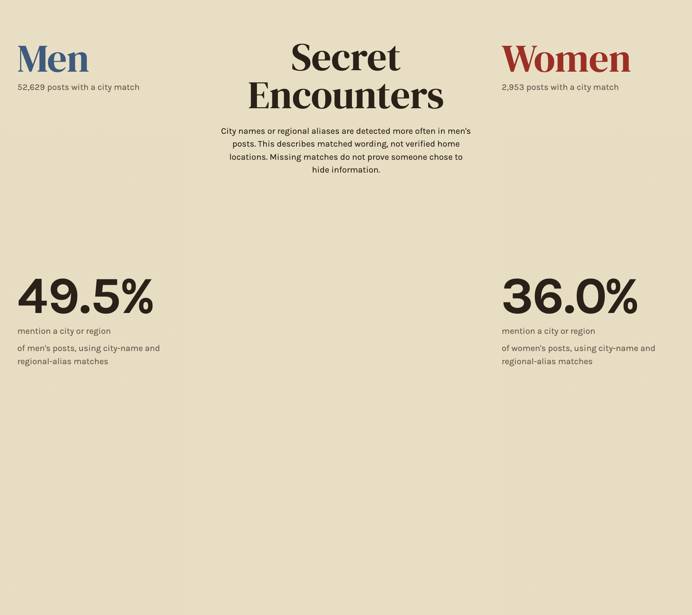
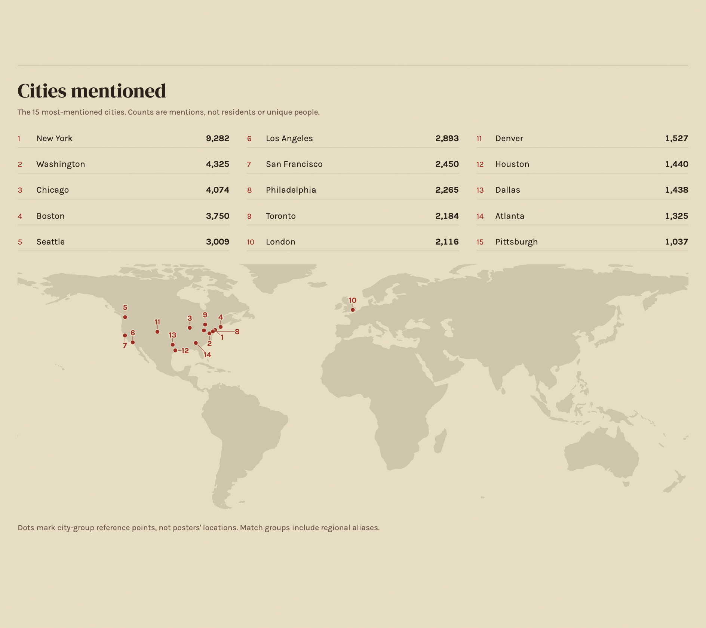
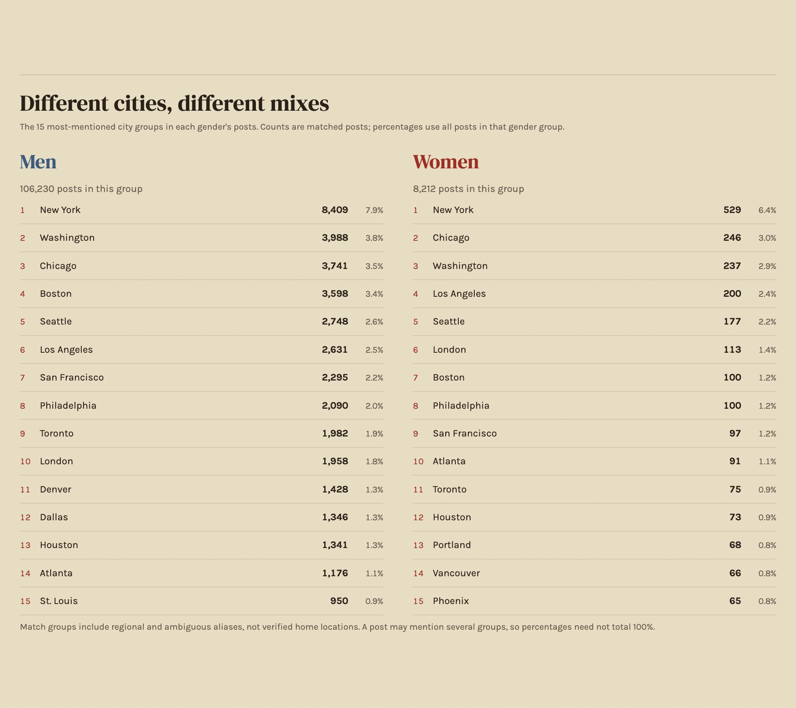
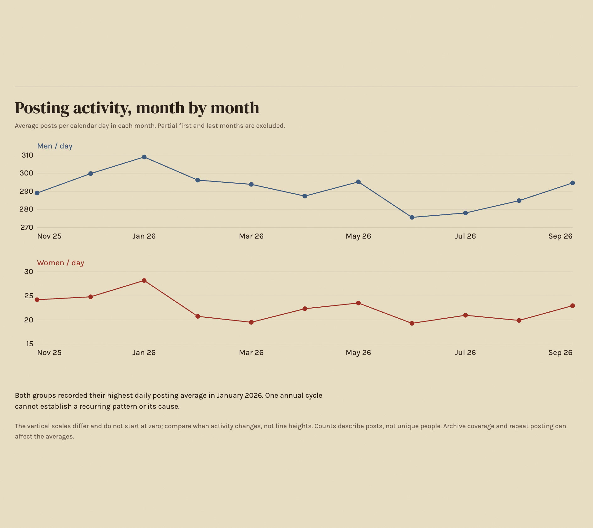
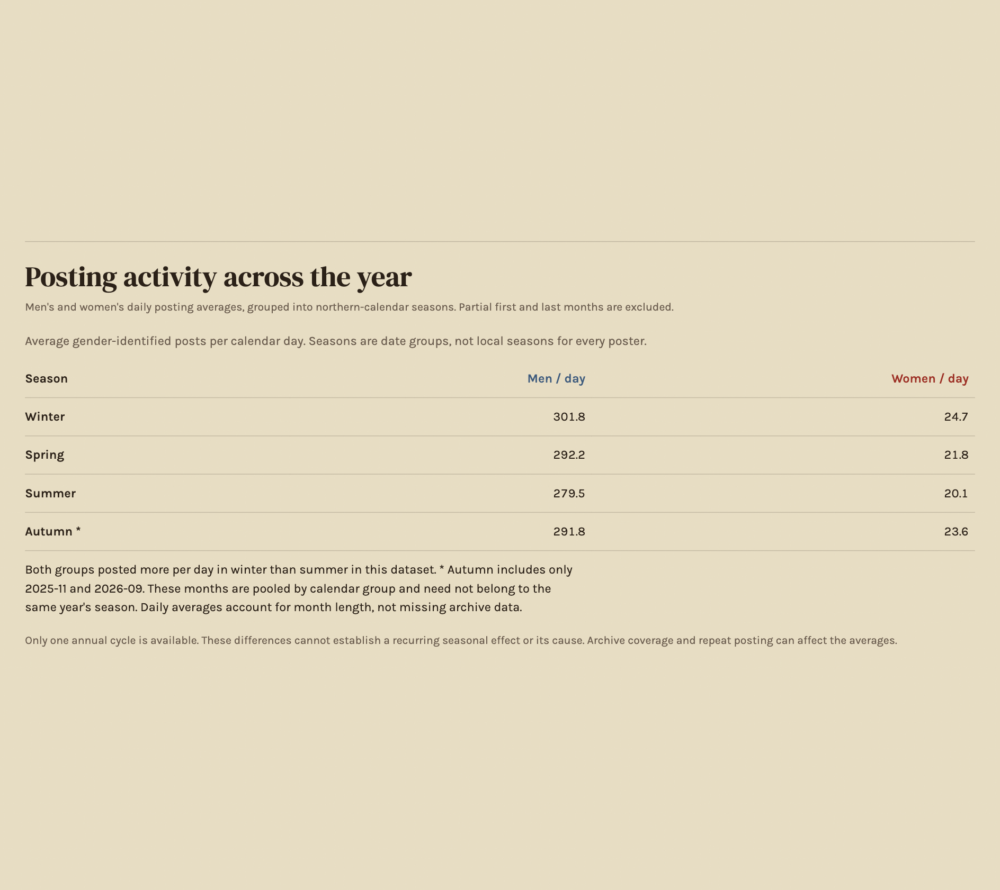

# Secret Encounters

Secret Encounters is a static scrollytelling infographic based on aggregated public posts from r/Affairs.

## Local preview

Start a local server from this folder and open http://localhost:8000/.

## Analysis

The story moves from gender shares, age, and seeking preferences to reason coverage, reason categories, and city coverage. Separate men's and women's top-15 city lists follow the map. The ending compares daily posting activity by month and calendar season for both genders. Detailed footer notes are expandable. Read [the analysis and limitations](ANALYSIS.md) for denominators and research checks; age-adjusted reasons remain research-only, not an extra chart.

Run `python3 scrape.py demo` to check the parser and analysis fixtures. Run `python3 scrape.py rebuild` to regenerate aggregates from saved local checkpoints without collecting new posts. Only aggregates are published; author-level comparisons are unavailable in the current checkpoints.

Optional local audit tools, not required by the website:

- `python3 validate.py` reports classification coverage and examples of potentially missed or misleading matches.
- `python3 audit_gender.py` compares gender extraction strategies and checks possible false positives across the saved corpus.

These scripts aid manual inspection; they are not labeled accuracy tests. Their output can include raw post excerpts and should remain local.

## Reddit Poster

Public [poster](https://srdkn.com/secret-encounters/poster.html) and [1600 x 2000 PNG](https://srdkn.com/secret-encounters/screenshots/reddit-poster.png). Local preview: http://localhost:8000/poster.html. The [local PNG](screenshots/reddit-poster.png) uses the same photo and palette, with figures derived from the published aggregate data.

## Screenshots

All 11 article screenshots are 1888 x 1682 pixels and are listed below in story order. Standalone sections are framed for the article without neighboring chapters or footer content.

### Opening

### Story chapters

### Cities

### Posting Activity

